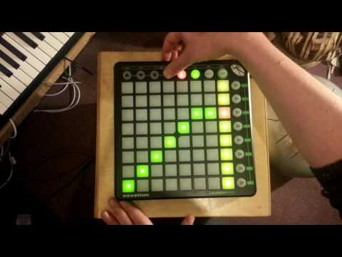

# Launch Step

A step sequencer for the Novation Launchpad Mk1 (and probably the Launchpad Mini, but I haven't tried that).

[](https://youtu.be/dS_x-FioqHM)

## Install

### Ubuntu/Debian Linux

```
sudo apt install build-essential git python libasound2-dev nodejs 
sudo apt install libjack-dev # or libjack-jackd2-dev
sudo npm install --global git+https://github.com/kasbah/launch-step
launch-step -h
```

### Mac OS

Launch Step should work on Mac OS but I haven't tried it and don't have any Apple hardware. You will need: 


- Some version of Xcode (or Command Line Tools)
- Python (for node-gyp)
- Jack and Core-Audio headers 
- NodeJS 

Then you should be able to install it as on Linux:

```
sudo npm install --global git+https://github.com/kasbah/launch-step
launch-step -h
```


### Windows

Launch Step could work on Windows but the problem is it uses a virtual MIDI port as it's output which Windows doesn't support. If you have any suggestions on how to make this work on Windows let me know.

## Usage

Buttons are currently assigned to the following: 

- Up      - Navigate one screen up towards higher notes
- Down    - Navigate one screen down (lower notes)
- Left    - Decrease number of steps by one
- Right   - Increase number of steps by one
- Session - Reset the entire session (deleting everything)
- User1   - Reset the cursor to the start of the sequence (and reset the clock if an internal clock is used)

```
Usage: launch-step [options]

  --help, -h

    Displays help information about this script

    'launch-step -h' or 'launch-step --help'


  --channel, -c

    MIDI channel number, the default is 1.

    'launch-step -c 2' or 'launch-step --channel=2'


  --tempo, -t

    Tempo in beats per minute. The default is 120. Can be set to "ext" to use an 
    external midi clock signal.

    'launch-step -t 133.2' or 'launch-step --tempo=133.2'


  --steps-per-beat, -p

    Number of steps per beat. The default is 2.

    'launch-step -p 4' or 'launch-step --steps-per-beat=4'


  --number-of-steps, -n

    Number of steps in the sequence. The default is 8.

    'launch-step -n 12' or 'launch-step --number-of-steps=12'


  --scale, -s

    The scale to apply to the rows. The default is 'major-pentatonic'. You can 
    specify a scale by name or use a progression of MIDI note numbers or note 
    names seperated by spaces. If you give a specific note like C3 or MIDI note 
    48 as the first note that note will be used as the root note if no root-note 
    option is given. Supported scale names are : 
 
    aeolian
    altered
    augmented
    augmented-heptatonic
    balinese
    bebop
    bebop-dominant
    bebop-locrian
    bebop-major
    bebop-minor
    chromatic
    composite-blues
    diminished
    dorian
    dorian-4
    double-harmonic-lydian
    double-harmonic-major
    egyptian
    enigmatic
    flamenco
    flat-six-pentatonic
    flat-three-pentatonic
    harmonic-major
    harmonic-minor
    hirajoshi
    hungarian-major
    hungarian-minor
    ichikosucho
    in-sen
    ionian-augmented
    ionian-pentatonic
    iwato
    kafi-raga
    kumoijoshi
    leading-whole-tone
    locrian
    locrian-2
    locrian-major
    locrian-pentatonic
    lydian
    lydian-5-p-pentatonic
    lydian-9
    lydian-augmented
    lydian-diminished
    lydian-dominant
    lydian-dominant-pentatonic
    lydian-minor
    lydian-pentatonic
    major
    major-blues
    major-flat-two-pentatonic
    major-pentatonic
    malkos-raga
    melodic-minor
    melodic-minor-fifth-mode
    melodic-minor-second-mode
    minor-7-m-pentatonic
    minor-bebop
    minor-blues
    minor-hexatonic
    minor-pentatonic
    minor-six-diminished
    minor-six-pentatonic
    mixolydian
    mixolydian-pentatonic
    mystery-1
    neopolitan
    neopolitan-major
    neopolitan-major-pentatonic
    neopolitan-minor
    oriental
    pelog
    persian
    phrygian
    piongio
    prometheus
    prometheus-neopolitan
    purvi-raga
    ritusen
    romanian-minor
    scriabin
    six-tone-symmetric
    spanish
    spanish-heptatonic
    super-locrian-pentatonic
    todi-raga
    vietnamese-1
    vietnamese-2
    whole-tone
    whole-tone-pentatonic

    for example:
    
      launch-step -s major
      launch-step --scale=major
      launch-step -s "C3 Eb F F# G Bb"
      launch-step -s "49 53 58 61"


  --root-note, -r

    The note to start the scale from. Can be a MIDI note number (0-127) or a 
    note name like 'A1', 'Bb1' or 'C#1'. The default is MIDI note 60 (C4).

    'launch-step -r A4' or 'launch-step --root-note=A4'


  --jack-midi, -j

    Use Jack MIDI.

    'launch-step -j' or 'launch-step --jack-midi'

```

